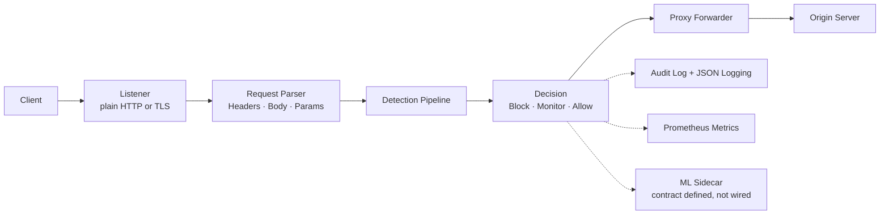
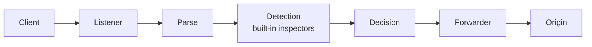

# FortressWAF

[](LICENSE)
[](https://go.dev/)

**A self-hosted Web Application Firewall / API security gateway, written in Go.**
FortressWAF is a reverse proxy that inspects HTTP traffic through a configurable
detection pipeline: SQL injection, XSS, RCE, request smuggling, bot traffic, and
more. Configuration is YAML and reloads at runtime. It ships as a single Go
binary, plus an optional Python ML sidecar and a Next.js dashboard.

> **Project status.** This is an academic showcase project, not a commercial
> product. Feature tables below label every module **stable** (implemented,
> enabled in the shipped config, tested against real payloads), **implemented,
> off by default** (real code that needs an external service or extra setup),
> **experimental** (works, but with known caveats), or **not implemented**.
> Known gaps are collected in [Known Limitations](#known-limitations) rather
> than papered over.

---

## Request flow



---

## Features

### Detection engine

Every module below is a built-in inspector. Those marked *stable* are enabled by
`deploy/config.yaml` and are what the WAF actually blocks traffic with.

| Module | Rule IDs | Status |
|---|---|---|
| SQL injection (tautology, UNION, stacked queries, blind/time-based, encoding bypass) | SQLI001–023 | **stable** |
| Cross-site scripting (tag, event handler, attribute, obfuscated) | XSS001+ | **stable** |
| RCE / command injection, SSTI, EL injection, deserialization gadgets, Log4Shell | RCE001+ | **stable** |
| Path traversal & parser hardening (encoding, null bytes) | PARSER_001+ | **stable** |
| HTTP request smuggling (CL.TE / TE.CL) | DSYNC_001+ | **stable** |
| Protocol anomalies (verb tampering, header smuggling, malformed requests) | PROT001+ | **stable** |
| Bot detection (attack-tool signatures; ordinary clients like `curl`, `axios`, and real browsers are not flagged) | BOT+ | **stable** |
| DDoS protection (slow loris, slow POST) | DDoS000+ | **stable** |
| Credential protection (brute force, stuffing, spray, lockout) | CRED+ | **stable** |
| File upload validation (MIME, extension, magic bytes) | UPL001+ | **stable** |
| API protection (mass assignment, schema hints) | API+ | **stable** |
| JA3 TLS fingerprinting | JA3_001+ | **stable** (TLS traffic only) |
| GraphQL inspection (depth, cost, aliases) | — | implemented, off by default |
| WebSocket frame validation | — | implemented, off by default |
| gRPC per-service rate limiting | GRPC001+ | implemented, off by default |
| SOAP/XML nesting depth | SOAP001+ | implemented, off by default |
| JWT / OAuth 2.0 introspection / mTLS / CAPTCHA | — | implemented, off by default |
| Adaptive challenge (JS / CAPTCHA interstitial) | — | experimental, off by default |
| Behavioural scoring (velocity, path entropy, reputation) | — | experimental, off by default |
| Response body inspection (data leakage) | LEAK001–008 | implemented — blocks responses leaking private keys, cloud keys, JWTs, DB DSNs, password hashes, or stack traces |
| eBPF telemetry, WASM sandbox | — | **not implemented** — stubs behind build tags |

Detection is measured, not assumed: the whole `ml-engine` training corpus
(1,402 payloads across 15 categories) is replayed through the engine in
`tests/unit/payload_corpus_test.go`, which fails if any category drops below a
documented floor. Measured detection rates: XXE 100%, XSS 99%, deserialization
97%, path traversal 87%, webshell 80%, LDAP 78%, SQLi 77%, command injection
66%, LFI 65%, SSTI 64%, RCE 62%. Three corpus categories (`csrf`, `ssrf`,
`open-redirect`) are deliberately excluded from the rate table — see
[Known Limitations](#known-limitations) for why.

### Observability

| Feature | Status |
|---|---|
| Prometheus metrics (`/metrics` on the admin API, plus a dedicated port) | **stable** |
| Structured JSON logging (slog) | **stable** |
| Tamper-evident audit log (hash-chained entries, admin API `/api/v1/audit`) | **stable** |
| Next.js dashboard (overview, detection modules, audit log, compliance) | **stable** — reads the endpoints above |
| SIEM export (Elasticsearch, Splunk HEC) | implemented, off by default |
| Grafana dashboards (`deploy/monitoring/grafana/dashboards/*.json`) | **stable** — two dashboards (Overview, Security) provisioned and rendered against live Prometheus data; see caveat in [Known Limitations](#known-limitations) |
| ML / compliance metrics in Grafana | **not available** — the exporter emits no such series, so the two dashboards that queried them were removed rather than left rendering empty panels |
| Protected-domain management with DNS verification | **stable** — add a domain in the console; it is only protected after the WAF itself resolves its A/AAAA record and confirms it points at this server |
| Full request log (IP, browser, headers) | **stable** — every inspected request is recorded with method, path, source IP, parsed browser/device, and full headers (credentials redacted) |
| IP ban / unban | **stable** — banned addresses are refused before inspection, on every site; bans can expire |
| Live training corpus + validated retrain | **stable** — high-confidence blocks are labelled by rule and appended to the corpus; the sidecar retrains and keeps the new model only if it scores at least as well |

### Management API

The admin API (`/api/v1` on the admin port) exposes auth/login, health, status,
config read/reload, sites, rules, compliance assessment, the audit log, plus the
operator endpoints: `metrics/snapshot`, `analytics`, `traffic`, `config/detail`,
`alerts`, `domains` (with `POST` add + DNS verification), `bans`, and
`training/status`. It requires a bearer token obtained from
`POST /api/v1/auth/login`.

Access controls, all verified live against the running stack:

* **Keys are compared in constant time** (`crypto/subtle`) at login and on every
  authenticated request, so response timing does not reveal a correct prefix.
* **Login requires username AND password.** With two configured keys the first
  is the username and the second the password, and both must match; a correct
  username with a wrong password is rejected. (A single key is accepted only
  when it appears in both fields.)
* **Failed logins are rate-limited.** Five wrong attempts per source address in
  a minute lock that address out for fifteen minutes, returning `429` with
  `Retry-After`. A locked-out caller is refused *before* the credential check,
  so a valid key is not confirmed while the lock is active.
* **No keys configured, no access.** The middleware fails closed (`503`) rather
  than serving protected routes unauthenticated.
* **`/auth/me` authenticates.** It used to reflect any bearer token back as an
  admin identity; it now requires a configured key.
* **The peer address is authoritative.** A client-supplied `X-Forwarded-For` is
  ignored unless the peer is listed in `admin.trusted_proxies`. Without this,
  per-IP rate limits, brute-force lockouts and bot scoring were all bypassable
  with one header, and the audit log recorded the spoofed address.
* **CORS is an allow list**, not `*`: only origins under
  `admin.cors_origins` may read authenticated API responses from a browser.
* **Admin request bodies are capped** at 1 MiB (`http.MaxBytesReader`); an
  oversized body gets `413` instead of being buffered.
* **Credentials are never logged.** The request log redacts any header whose
  name looks like a credential (`Authorization`, `Cookie`, `X-API-Key`, and
  anything containing `token`/`secret`/`auth`/…), case-insensitively.

---

## Quick start

Ports come from **command-line flags**, not from the config file (the config's
`admin.port` is only reported in status output). The shipped config listens in
**plain HTTP**: TLS is off because the demo stack has no certificate. Turning
`tls.enabled: true` on without valid `cert_file`/`key_file` makes the proxy exit
on startup.

```bash
git clone https://github.com/FortressWAF/FortressWAF.git
cd FortressWAF

# Build the single binary
go build -o fortresswaf ./cmd/proxy

# Run it: proxy on 8080, admin API on 8443
./fortresswaf -config deploy/config.yaml -proxy-port 8080 -admin-port 8443
```

The database is optional: the proxy only connects when `db.driver` and `db.dsn`
are both set, and a failed ping is a warning, not a fatal error. To run the full
stack (proxy + Postgres + ML sidecar + dashboard) instead:

```bash
docker compose -f deploy/docker-compose.yml up -d
```

To rebuild from source and redeploy safely — recreating the source images,
restarting Caddy so its service-DNS cache does not go stale, and verifying the
browser path (page + login + every admin API) — use the deploy script:

```bash
sudo bash scripts/deploy.sh            # rebuild everything, redeploy, verify
sudo SKIP_BUILD=1 bash scripts/deploy.sh   # recreate + verify only
```

> Why Caddy matters: when a service container is recreated, Caddy can hold a
> stale address for it and start returning `502` for the admin API, which makes
> the dashboard look unreachable even though its pages load. `scripts/deploy.sh`
> restarts Caddy after every recreate and re-checks the full path. If the
> dashboard ever returns `502`, run `make restart-caddy` (or
> `docker compose -f deploy/docker-compose.yml restart caddy`).

> Verified end to end in this sandbox: `go build`, `go vet`, `go test ./...`,
> a live smoke test of the binary, and a full `docker compose up` of the
> proxy, Postgres, ML sidecar, dashboard, and monitoring stack — every service
> reached a healthy state, the WAF blocked attack payloads through the stack,
> and Grafana rendered real metrics. See [Demo scenario](#demo-scenario) and
> [Known Limitations](#known-limitations).

Minimal config (what `deploy/config.yaml` actually contains, abridged):

```yaml
admin:
  enabled: true
  # Two entries = username + password, and BOTH must match to log in. The real
  # values come from deploy/.env (gitignored) via these ${...} refs, so they
  # never land in the repository.
  api_keys: [${ADMIN_EMAIL}, ${ADMIN_PASSWORD}]

sites:
  - name: default
    domains: [localhost]
    upstream: http://127.0.0.1:3000   # your backend
    waf_enabled: true

sqli:    { enabled: true }
xss:     { enabled: true }
rce:     { enabled: true }
# ...one entry per inspector; see deploy/config.yaml for the full list
```

---

## Demo scenario

A scripted walkthrough a reviewer can follow live. The protected site's upstream
in `deploy/config.yaml` points at the intentionally vulnerable demo app built
from `deploy/demo-app/` (github.com/daffainfo/vulnerable-web), so benign
requests get a real page while its SQL injection, file inclusion and XSS
payloads are blocked at the WAF. That container sits on its own `demo-net`
bridge with `internal: true`: no route off the host, and no path to Postgres,
the ML sidecar or the admin API. Running the binary on its own instead, benign
requests answer **502** -- the WAF allowed them through and nothing is
listening at the configured upstream. That 502 is the benign path; a blocked
request answers 403 with a JSON body naming the rule.

### Public deployment

`deploy/docker-compose.yml` runs Caddy as the TLS edge and routes each host to
its container; the WAF's own listeners are bound to loopback. The dashboard and
its admin API are served on **one origin** (the dashboard host serves `/` and
`/api/*`), so a browsing phone talks to a single hostname. The live instance is
reachable at:

| Host | What it serves | Credentials |
| --- | --- | --- |
| `fort.tkjt3yapera.my.id` | Dashboard + admin API (`/api/*`) | email + password from `deploy/.env` |
| `demo.tkjt3yapera.my.id` | Vulnerable demo app, behind the WAF | app login: `administrator` / `administrator` |
| `grafana.tkjt3yapera.my.id` | Grafana, served around the WAF | `admin` / `admin` -- change it via `GRAFANA_PASSWORD` in `deploy/.env` |

> The admin credentials are **not** in this repository. Set `ADMIN_EMAIL` and
> `ADMIN_PASSWORD` in `deploy/.env` (gitignored); `deploy/config.yaml` references
> them via `${ADMIN_EMAIL}` / `${ADMIN_PASSWORD}`.

```bash
curl -A 'Mozilla/5.0 (X11; Linux x86_64) AppleWebKit/537.36 Chrome/120 Safari/537.36' \
     https://demo.tkjt3yapera.my.id/                       # 200, the lab app
curl -A 'Mozilla/5.0 (X11; Linux x86_64) AppleWebKit/537.36 Chrome/120 Safari/537.36' \
     "https://demo.tkjt3yapera.my.id/users/index.php?q=1'%20OR%20'1'='1"   # 403 SQLI016
```

The same walkthrough is available as a self-checking script: it asserts each
expected rule (and that benign traffic is *not* blocked) and exits non-zero if
anything regresses. Run it against the binary on :8080, or override the URLs
for the compose stack, whose proxy is published on port 80.

```bash
./demo/exhibition-script.sh                              # binary: :8080 / :8443
PROXY_URL=http://localhost ./demo/exhibition-script.sh   # compose: :80 / :8443
```

```bash
# A normal browser request must pass through to the backend.
curl -H "User-Agent: Mozilla/5.0 (X11; Linux x86_64) AppleWebKit/537.36 (KHTML, like Gecko) Chrome/120.0 Safari/537.36" \
     http://localhost:8080/

# 1. SQL injection -> 403 SQLI016
curl -H "User-Agent: Mozilla/5.0 ..." "http://localhost:8080/search?q=1'%20OR%201=1--"

# 2. Cross-site scripting -> 403 XSS001
curl -H "User-Agent: Mozilla/5.0 ..." "http://localhost:8080/search?q=<script>alert(1)</script>"

# 3. Command injection -> 403 RCE001
curl -H "User-Agent: Mozilla/5.0 ..." "http://localhost:8080/cmd?c=;id"

# 4. Read the audit log (hash-chained, tamper-evident)
TOKEN=$(curl -s -X POST http://localhost:8443/api/v1/auth/login \
        -H "Content-Type: application/json" \
        -d '{"email":"admin@example.com","password":"<your password>"}' | sed 's/.*"token":"\([^"]*\)".*/\1/')
curl -H "Authorization: Bearer $TOKEN" "http://localhost:8443/api/v1/audit?limit=5"

# 5. Ask the compliance module what it can actually verify
curl -H "Authorization: Bearer $TOKEN" http://localhost:8443/api/v1/compliance/pci-dss/assessment
```

Two things worth pointing out to an audience:

* **Use a browser User-Agent.** `curl` is on the bot signature list, so a
  default curl request is blocked as `BOT004` before any payload inspection —
  which looks like a bug during a demo if you do not explain it.
* **False positives were tested for, not just attacks.** Each detection module
  has a false-positive test (`TestFalsePositive_*` in `tests/unit/`) that
  replays benign input — ordinary English containing SQL keywords, browser
  User-Agents, benign paths — and fails if any of it is blocked.

To show blocked traffic as charts rather than curl output, bring up the
monitoring stack alongside the main one and open Grafana at
<http://localhost:3001> (admin/admin):

```bash
docker compose -f deploy/monitoring/docker-compose.monitoring.yml up -d
```

The "FortressWAF Overview" dashboard shows requests/sec, the allowed-vs-blocked
split, and the block ratio; "FortressWAF Security" breaks the enforcement
actions (blocked, monitored, challenged, rate-limited) out separately. Both
refresh every 10 seconds, so payloads sent through the proxy appear on screen
during the demo.

---

## Architecture



```
cmd/proxy/           WAF server entry point (flags, admin router, wiring)
internal/
  engine/            Detection pipeline (all inspectors live here)
  config/            YAML config with live reload (atomic save)
  compliance/        Control verification + hash-chained audit log
  sites/             Protected-domain management with DNS verification
  blocklist/         IP ban / unban store
  traincorpus/       Live training-corpus collector (high-confidence blocks)
  uaparse/           User-Agent -> browser / OS / device summary
  siem/              SIEM event export
  ml/                Client for the Python ML sidecar (not called by cmd/proxy)
dashboard/           Web dashboard (Next.js)
ml-engine/           ML sidecar (Python/FastAPI) — see status below
deploy/              docker-compose, config, monitoring, Caddyfile
docs/                Design documentation (see caveat in Known Limitations)
```

`internal/` also contains packages that compile but are **not wired into the
proxy**: `billing`, `tenant`, `geo`, `ratelimit`, `reputation`, `session`.
Nothing in `cmd/proxy` imports them; they are leftover scaffolding and should not
be read as working features. (The former `internal/api` and `internal/rules`
packages were deleted — `internal/api` carried an auth bypass and an
unauthenticated WebSocket that nothing used.)

---

## Performance

Re-measured on the reference build host (DO-Regular, 4 vCPU, 8 GB RAM, Linux
5.15) with the shipped inspector set, using the same command the
`benchmark.yml` CI workflow runs:

```bash
go test -bench=. -benchmem -run=^$ ./tests/unit/ -count=5
```

Full run: 15 benchmarks, 75 runs, 134.3s, all passing. Complete raw output and
the per-benchmark analysis live in [BENCHMARK.md](BENCHMARK.md).

| Benchmark | Result | Per-core rate |
|---|---|---|
| Single payload, RCE | ~311 ns/op (144 B, 1 alloc) | ~3.2M inspections/s |
| Single payload, XSS | ~329 ns/op (144 B, 1 alloc) | ~3.0M inspections/s |
| Single payload, SQLi | ~354 ns/op (144 B, 1 alloc) | ~2.8M inspections/s |
| Protocol detection | ~16.3 µs/op (7.7 KB, 48 allocs) | ~61k/s |
| RequestContext creation | ~20.3 µs/op (7.7 KB, 81 allocs) | ~49k ctx/s |
| Single user agent, bot | ~31.8 µs/op (938 B, 3 allocs) | ~31k/s |
| SQLi / RCE / XSS detection | ~35–37 µs/op (17 KB, ~160 allocs) | ~28k/s |
| Full engine, benign request | ~394 µs/op (110 KB, 25 allocs) | ~2,500 req/s |
| Full engine, attack request | ~404 µs/op (150 KB, 25 allocs) | ~2,500 req/s |
| DDoS protection | ~267 µs/op (255 KB, ~30 allocs) | ~3,700 req/s |
| Bot detection | ~618 µs/op (14 KB, 87 allocs) | ~1,600/s |
| Full engine inspection (batch) | ~1.77 ms/op (542 KB, 149 allocs) | — |

Latency overhead per request with the full engine is roughly **0.4 ms** on this
hardware, i.e. ~10k req/s of pure inspection headroom across the 4 vCPU. The
single-payload hot path is essentially allocation-free (1 alloc, 144 B), so the
per-request cost is dominated by the full-pipeline allocs (~25 for a whole
request, ~160 when a detector matches). These are the numbers actually measured
on this host, not marketing figures; absolute throughput will differ on
production hardware.

---

## Security posture

`govulncheck ./...` reports **0 vulnerabilities in code paths** (4 remain in
required modules, none called) and `npm audit` reports **0** for the dashboard.
Detection rates are replayed from the payload corpus in
`tests/unit/payload_corpus_test.go`.

## Known limitations

Stated plainly, because hiding them would be worse than having them:

1. **The ML sidecar is not in the request path.** `internal/ml/client.go` and
   `ml-engine/api/app.py` agree on a request/response contract (verified: the
   Go request struct matches the FastAPI schema field for field, and both
   endpoints answer on the running sidecar), but the proxy never calls it —
   detection is entirely rule-based. The bundled model is also untrained:
   `ml-engine` answers from heuristic scoring, and it mislabels payloads
   (a SQLi string is returned as `command-injection` at ~8% confidence). The
   sidecar starts and reports healthy in the docker stack, and its
   `/v1/classify` and `/v1/inspect` endpoints work, but treat the ML component
   as scaffolding, not a working classifier.
2. **Compliance is verification, not enforcement.** The compliance module
   checks a subset of controls against live runtime state (is the WAF enabled?
   are the SQLi/XSS inspectors on? is the audit log actually recording?).
   PCI-DSS has 10 such automated controls; the remaining 15 per framework need
   evidence no software can supply and are labelled `manual`. With TLS
   disabled, as in the shipped config, the TLS-dependent frameworks report 0%.
3. **No inspector for SSRF, open redirect, or CSRF.** These categories are
   excluded from the corpus detection-rate test rather than silently asserted.
4. **Rules are not loaded from disk.** The bundled `rules/` directory is
   unused; detection comes entirely from the built-in inspectors. A config
   glob for rule files parses but is not read.
5. **Dead code is present** (see the architecture note): `billing`, `tenant`,
   `geo`, `ratelimit`, `reputation`, `session`. None of them are imported by
   `cmd/proxy`. (The previously-listed `internal/api` and `internal/rules` were
   removed: `internal/api` carried an auth bypass and an unauthenticated
   WebSocket that nothing used, so the whole package was deleted rather than
   left as a landmine.)
6. **Response body inspection detects leaks, within a 1 MiB window.** The
   upstream response is buffered (up to 1 MiB) and scanned for eight classes of
   leaked secret before any byte reaches the client; a hit is blocked with 502
   and logged. Responses larger than the window are flushed and streamed past
   that point uninspected. It is pattern-based, not entropy-based, so an
   obscured or non-standard secret can still slip through.
7. **The dashboard's admin token lives in `sessionStorage`.** It is scoped to
   the tab and cleared on close, and the dashboard ships a strict
   Content-Security-Policy with no remote script origins, so the XSS path that
   would expose the token is closed. It is still JavaScript-readable; an
   httpOnly session cookie from the admin API is the follow-up that would
   remove that entirely.
8. **`docs/` is aspirational.** The documentation directory describes the
   intended product, including billing, multi-tenancy, and an
   enterprise/community feature split that the code does not implement. Trust
   this README and `deploy/config.yaml` for what actually works; read `docs/`
   as design notes.
9. **The Docker stack runs, and only what it runs is claimed.** The stack
   (proxy + Postgres + ML sidecar + dashboard) and the separate monitoring
   stack (Prometheus + Grafana + Loki + Alertmanager) were both built and
   started end to end; all healthchecks pass. Two caveats remain: Alertmanager
   receivers point at a local sink (`http://127.0.0.1:5001`) because real
   delivery needs SMTP/Slack credentials, and the monitoring stack is a
   second `docker compose` file that must be brought up separately.
10. **Untrained-model honesty:** detection rates in the feature table are
   measured against a payload corpus, which is a lab measurement — not proof
   of performance against a skilled attacker with bypass tooling.

---

## Documentation

| Document | Contents |
|---|---|
| [BENCHMARK.md](BENCHMARK.md) | Current benchmark results, environment, and analysis |
| [Getting Started](docs/getting-started.md) | Installation and first config |
| [Architecture](docs/architecture.md) | Pipeline details and deployment modes |
| [Configuration](docs/configuration.md) | Full YAML reference |
| [Rule Language](docs/rule-language.md) | Rule DSL syntax |
| [API Reference](docs/api-reference.md) | REST API docs |
| [Deployment](docs/deployment.md) | Docker, K8s, cloud |
| [Compliance](docs/compliance.md) | PCI-DSS, SOC2, GDPR references |
| [Troubleshooting](docs/troubleshooting.md) | Common issues |

See limitation 7 above: these describe the intended design and overstate what is
implemented.

---

## License

AGPL-3.0. See [LICENSE](LICENSE).
