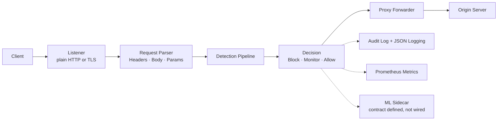
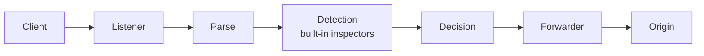

# FortressWAF

[](LICENSE)
[](https://go.dev/)

**A self-hosted Web Application Firewall / API security gateway, written in Go.**
FortressWAF is a reverse proxy that inspects HTTP traffic through a configurable
detection pipeline: SQL injection, XSS, RCE, request smuggling, bot traffic, and
more. Configuration is YAML and reloads at runtime. It ships as a single Go
binary, plus an optional Python ML sidecar and a Next.js dashboard.

> **Project status.** This is an academic showcase project, not a commercial
> product. Feature tables below label every module **stable** (implemented,
> enabled in the shipped config, tested against real payloads), **implemented,
> off by default** (real code that needs an external service or extra setup),
> **experimental** (works, but with known caveats), or **not implemented**.
> Known gaps are collected in [Known Limitations](#known-limitations) rather
> than papered over.

---

## Request flow



---

## Features

### Detection engine

Every module below is a built-in inspector. Those marked *stable* are enabled by
`deploy/config.yaml` and are what the WAF actually blocks traffic with.

| Module | Rule IDs | Status |
|---|---|---|
| SQL injection (tautology, UNION, stacked queries, blind/time-based, encoding bypass) | SQLI001–023 | **stable** |
| Cross-site scripting (tag, event handler, attribute, obfuscated) | XSS001+ | **stable** |
| RCE / command injection, SSTI, EL injection, deserialization gadgets, Log4Shell | RCE001+ | **stable** |
| Path traversal & parser hardening (encoding, null bytes) | PARSER_001+ | **stable** |
| HTTP request smuggling (CL.TE / TE.CL) | DSYNC_001+ | **stable** |
| Protocol anomalies (verb tampering, header smuggling, malformed requests) | PROT001+ | **stable** |
| Bot detection (signature list; `curl` is listed as a bad bot) | BOT+ | **stable** |
| DDoS protection (slow loris, slow POST) | DDoS000+ | **stable** |
| Credential protection (brute force, stuffing, spray, lockout) | CRED+ | **stable** |
| File upload validation (MIME, extension, magic bytes) | UPL001+ | **stable** |
| API protection (mass assignment, schema hints) | API+ | **stable** |
| JA3 TLS fingerprinting | JA3_001+ | **stable** (TLS traffic only) |
| GraphQL inspection (depth, cost, aliases) | — | implemented, off by default |
| WebSocket frame validation | — | implemented, off by default |
| gRPC per-service rate limiting | GRPC001+ | implemented, off by default |
| SOAP/XML nesting depth | SOAP001+ | implemented, off by default |
| JWT / OAuth 2.0 introspection / mTLS / CAPTCHA | — | implemented, off by default |
| Adaptive challenge (JS / CAPTCHA interstitial) | — | experimental, off by default |
| Behavioural scoring (velocity, path entropy, reputation) | — | experimental, off by default |
| Response body inspection (data leakage) | — | **not implemented** — registered stub, `Inspect()` is a no-op |
| eBPF telemetry, WASM sandbox | — | **not implemented** — stubs behind build tags |

Detection is measured, not assumed: the whole `ml-engine` training corpus
(1,126 payloads across 11 categories) is replayed through the engine in
`tests/unit/payload_corpus_test.go`. Measured detection rates: XXE 100%, XSS
99%, deserialization 97%, webshell 80%, LDAP 78%, SQLi 78%, command injection
66%, SSTI 64%, RCE 62%, LFI 59%, path traversal 57%.

### Observability

| Feature | Status |
|---|---|
| Prometheus metrics (`/metrics` on the admin API, plus a dedicated port) | **stable** |
| Structured JSON logging (slog) | **stable** |
| Tamper-evident audit log (hash-chained entries, admin API `/api/v1/audit`) | **stable** |
| SIEM export (Elasticsearch, Splunk HEC) | implemented, off by default |
| Grafana dashboards (`deploy/monitoring/grafana/dashboards/*.json`) | **not verified** — definitions are bundled but were never rendered end to end |

### Management API

The admin API (`/api/v1` on the admin port) exposes auth/login, health, status,
config read/reload, sites, rules, compliance assessment, and the audit log. It
requires a bearer token obtained from `POST /api/v1/auth/login`.

---

## Quick start

Ports come from **command-line flags**, not from the config file (the config's
`admin.port` is only reported in status output). The shipped config listens in
**plain HTTP**: TLS is off because the demo stack has no certificate. Turning
`tls.enabled: true` on without valid `cert_file`/`key_file` makes the proxy exit
on startup.

```bash
git clone https://github.com/FortressWAF/FortressWAF.git
cd FortressWAF

# Build the single binary
go build -o fortresswaf ./cmd/proxy

# Run it: proxy on 8080, admin API on 8443
./fortresswaf -config deploy/config.yaml -proxy-port 8080 -admin-port 8443
```

The database is optional: the proxy only connects when `db.driver` and `db.dsn`
are both set, and a failed ping is a warning, not a fatal error. To run the full
stack (proxy + Postgres + ML sidecar + dashboard) instead:

```bash
docker compose -f deploy/docker-compose.yml up -d
```

> Verified in this sandbox: `go build`, `go vet`, `go test ./...`, and a live
> smoke test of the binary. **The Docker stack was not** — this sandbox has
> podman without a compose plugin, so the compose file was validated by
> inspection and its healthchecks were checked against the binary, not by
> `compose up`. Run it once on the presentation machine before the demo.

Minimal config (what `deploy/config.yaml` actually contains, abridged):

```yaml
admin:
  enabled: true
  api_keys: [fortress-demo-admin]   # any value here logs in as admin

sites:
  - name: default
    domains: [localhost]
    upstream: http://127.0.0.1:3000   # your backend
    waf_enabled: true

sqli:    { enabled: true }
xss:     { enabled: true }
rce:     { enabled: true }
# ...one entry per inspector; see deploy/config.yaml for the full list
```

---

## Demo scenario

A scripted walkthrough a reviewer can follow live. The protected site's upstream
in `deploy/config.yaml` points at the dashboard container, so benign requests
return a real page while attacks are blocked at the WAF.

```bash
# A normal browser request must pass through to the backend.
curl -H "User-Agent: Mozilla/5.0 (X11; Linux x86_64) AppleWebKit/537.36 (KHTML, like Gecko) Chrome/120.0 Safari/537.36" \
     http://localhost:8080/

# 1. SQL injection -> 403 SQLI016
curl -H "User-Agent: Mozilla/5.0 ..." "http://localhost:8080/search?q=1'%20OR%201=1--"

# 2. Cross-site scripting -> 403 XSS001
curl -H "User-Agent: Mozilla/5.0 ..." "http://localhost:8080/search?q=<script>alert(1)</script>"

# 3. Command injection -> 403 RCE001
curl -H "User-Agent: Mozilla/5.0 ..." "http://localhost:8080/cmd?c=;id"

# 4. Read the audit log (hash-chained, tamper-evident)
TOKEN=$(curl -s -X POST http://localhost:8443/api/v1/auth/login \
        -H "Content-Type: application/json" \
        -d '{"email":"a@b.com","password":"fortress-demo-admin"}' | sed 's/.*"token":"\([^"]*\)".*/\1/')
curl -H "Authorization: Bearer $TOKEN" "http://localhost:8443/api/v1/audit?limit=5"

# 5. Ask the compliance module what it can actually verify
curl -H "Authorization: Bearer $TOKEN" http://localhost:8443/api/v1/compliance/pci-dss/assessment
```

Two things worth pointing out to an audience:

* **Use a browser User-Agent.** `curl` is on the bot signature list, so a
  default curl request is blocked as `BOT004` before any payload inspection —
  which looks like a bug during a demo if you do not explain it.
* **False positives were tested for, not just attacks.** Each detection module
  has a false-positive test (`TestFalsePositive_*` in `tests/unit/`) that
  replays benign input — ordinary English containing SQL keywords, browser
  User-Agents, benign paths — and fails if any of it is blocked.

---

## Architecture



```
cmd/proxy/           WAF server entry point (flags, admin router, wiring)
internal/
  engine/            Detection pipeline (all inspectors live here)
  config/            YAML config with live reload
  compliance/        Control verification against live runtime state
  siem/              SIEM event export
  ml/                Client for the Python ML sidecar
dashboard/           Web dashboard (Next.js)
ml-engine/           ML sidecar (Python/FastAPI) — see status below
deploy/              docker-compose, config, monitoring
docs/                Design documentation (see caveat in Known Limitations)
```

`internal/` also contains packages that compile but are **not wired into the
proxy**: `api`, `billing`, `tenant`, `geo`, `ratelimit`, `reputation`, `session`,
`rules`. Nothing in `cmd/proxy` imports them. They are left in place rather than
deleted so earlier documentation stays navigable; do not read them as working
features.

---

## Performance

Measured on the development laptop (Intel i5-7200U, 2 cores / 4 threads) with
the shipped inspector set. Reproduce with:

```bash
go test -bench=. -benchtime=200x -run=^$ ./tests/unit/
```

| Benchmark | Result | Per-core rate |
|---|---|---|
| Single payload, SQLi | ~320 ns/op | ~3.1M inspections/s |
| Single payload, XSS | ~257 ns/op | ~3.9M inspections/s |
| Single payload, RCE | ~224 ns/op | ~4.5M inspections/s |
| Full engine, benign request | ~181 µs/op | ~5,500 req/s |
| Full engine, attack request | ~195 µs/op | ~5,100 req/s |
| RequestContext creation | ~14 µs/op | ~70k ctx/s |

Latency overhead per request with the full engine is roughly 0.2 ms on this
hardware. Server-grade CPUs will be faster; the numbers above are the ones
actually measured here, not marketing figures.

---

## Known limitations

Stated plainly, because hiding them would be worse than having them:

1. **The ML sidecar is not in the request path.** `internal/ml/client.go` and
   `ml-engine/api/app.py` now agree on a request/response contract, but the
   proxy never calls it — detection is entirely rule-based. The bundled model
   is also untrained: `ml-engine` falls back to heuristic scoring. Treat the
   ML component as scaffolding, not a working classifier.
2. **Compliance is verification, not enforcement.** The compliance module
   checks a subset of controls against live runtime state (is the WAF enabled?
   are the SQLi/XSS inspectors on? is the audit log actually recording?).
   PCI-DSS has 10 such automated controls; the remaining 15 per framework need
   evidence no software can supply and are labelled `manual`. With TLS
   disabled, as in the shipped config, the TLS-dependent frameworks report 0%.
3. **No inspector for SSRF, open redirect, or CSRF.** These categories are
   excluded from the corpus detection-rate test rather than silently asserted.
4. **Rules are not loaded from disk.** The bundled `rules/` directory is
   unused; detection comes entirely from the built-in inspectors. A config
   glob for rule files parses but is not read.
5. **Dead code is present** (see the architecture note): `internal/api`,
   `billing`, `tenant`, `geo`, `ratelimit`, `reputation`, `session`, `rules`.
   The dashboard still calls some endpoints these would have served
   (`/api/admin/tenants`, `/api/partner/*`, `/api/checkout`, `/api/products`),
   so those pages show errors.
6. **Response body inspection is a no-op stub** — registered, does nothing.
7. **`docs/` is aspirational.** The documentation directory describes the
   intended product, including billing, multi-tenancy, and an
   enterprise/community feature split that the code does not implement. Trust
   this README and `deploy/config.yaml` for what actually works; read `docs/`
   as design notes.
8. **The Docker stack was validated by inspection, not execution** (no compose
   runtime in the sandbox). Healthchecks were verified against the live binary.
9. **Untrained-model honesty:** detection rates in the feature table are
   measured against a payload corpus, which is a lab measurement — not proof
   of performance against a skilled attacker with bypass tooling.

---

## Documentation

| Document | Contents |
|---|---|
| [Getting Started](docs/getting-started.md) | Installation and first config |
| [Architecture](docs/architecture.md) | Pipeline details and deployment modes |
| [Configuration](docs/configuration.md) | Full YAML reference |
| [Rule Language](docs/rule-language.md) | Rule DSL syntax |
| [API Reference](docs/api-reference.md) | REST API docs |
| [Deployment](docs/deployment.md) | Docker, K8s, cloud |
| [Compliance](docs/compliance.md) | PCI-DSS, SOC2, GDPR references |
| [Troubleshooting](docs/troubleshooting.md) | Common issues |

See limitation 7 above: these describe the intended design and overstate what is
implemented.

---

## License

AGPL-3.0. See [LICENSE](LICENSE).
